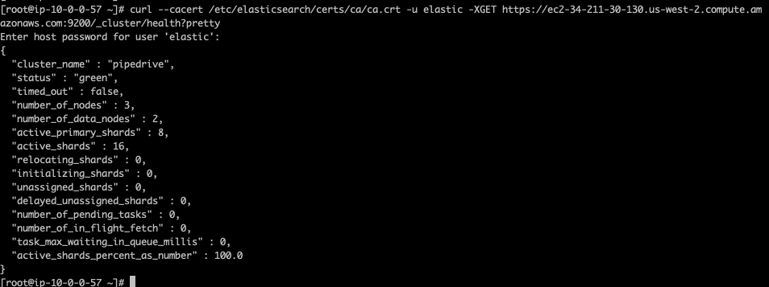
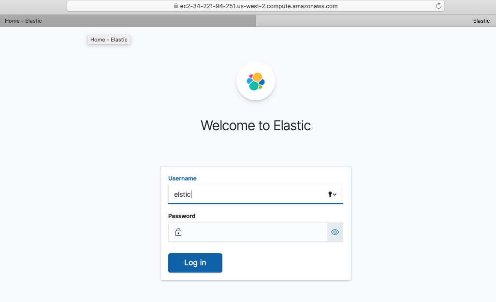

# ELK Automation

Automation to provision the Elastick stack (Elasticsearch, Logstash, and Kibana) to AWS using Ansible and Terraform with the following components:
- 3 Elasticsearch nodes
- 1 Logstash node
- 1 Kibana node

## Requirements / Technologies
To successfully deploy this project, you need to have the below software requirements installed:
- Terraform v0.14+
- Ansible v2.10+
- Python 3
- AWS CLI
- Code editor (I use Visual Studio Code)

You will also need an Active AWS subscription for this procedure.

Also, this automation script is specifically for Amazon Linux OS at the moment.

## Deployment Steps
1. Download the above requirements to your local computer and ensure you can execute from the terminal
2. Clone this repository
6. Open up a terminal from your PC into this cloned repo path 

There are a number of variables to be supplied to ensure an error free deployment:
- Open up [terraform.tfvars.example](terraform.tfvars.example) file and supply in your AWS credential information
	```Bash
    region          = <AWS Region>
	aws_credentials = <Path/to/aws/credential/file >
	profile         = <AWS profile if any>
	environment     = <Tags>
	instance_type   = <EC2 instance size>
	```
- Having filled the above, rename the file to `terraform.tfvars` being the standard Terraform variable file structure
- From the terminal, at the root repo, run the command `terraform init` to initialise terraform and download all modules
- Deploy the terraform script with the command `terraform apply` Enter 'yes' at the prompt.

If all goes well, you should see a completed deployment with outputs showing an array of public DNS for all deployed nodes. The DNS is in the below order:
	- elasticsearch_master_node
	- elasticsearch_data_node01
	- elasticsearch_data_node02
	- logstash_node
	- kibana_node
You will also see an ssh key generated to access each nodes.

Navigate to the following ansible paths and supply in the DNS info:
- [variable_file](playbooks/vars.example.yaml): rename this file to `vars.yaml` from your local
	```Bash
    elastic_dns: <elasticsearch_master_node>
    elastic_node01_dns: <elasticsearch_data_node01>
    elastic_node02_dns: <elasticsearch_data_node02>
    logstash_dns: <logstash_node>
    kibana_dns: <kibana_node>
	```
- [ansible_hosts_file](playbooks/hosts.example): rename this file to `hosts`on your local
	```Bash
    [all:children]
    elasticsearch
    logstash
    kibana

    [all:vars]
    ansible_user=ec2-user
    ansible_private_key_file= <path/to/generated/ssh/key>
    ansible_port=22

    [elasticsearch:children]
    elasticsearch_master
	elastic_datanode

    [elasticsearch_master]
    <elasticsearch_master_node_dns>

    [elastic_datanode]
   	<elasticsearch_node01_dns>
    <elasticsearch_node02_dns>

    [logstash]
    <logstash_dns>

    [kibana]
    <kibana_dns>
	```
- [input_instance_file_to_generate_tls_certificates](playbooks/files/instance.yaml)
	```Bash
        instances:
          - name: "<elasticsearch_master_node_dns>"
            dns: [ '<elasticsearch_master_node_dns>' ]
          - name: "<elasticsearch_node01_dns>"
            dns: [ 'elasticsearch_node01_dns' ]
          - name: "<elasticsearch_node02_dns>"
            dns: [ '<elasticsearch_node02_dns>' ]
          - name: "<logstash_dns>"
            dns: [ '<logstash_dns>' ]
          - name: "<kibana_dns>"
            dns: [ '<kibana_dns>' ]
    ```
- Having supplied the above information and renamed files, navigate to the [playbooks](playbooks) directory from your terminal and execute the command:
`ansible-playbook playbook.yaml`

The below processes are configured with ansible:
- Installation of ELK components
- Configuration of all ELK services
- Setup and configuration of TLS and HTTP encryption

After ansible provisioning is completed, you need to generate usernames and password first for Kibana and Elasticsearch.
- SSH to elasticsearch box using the generated keys from terraform output
- Run the command below as root to generated credentials
`sudo /usr/share/elasticsearch/bin/elasticsearch-setup-passwords auto`
- Copy creds for Elasticsearch and Kibana
- Run the below command to see the health of cluster
		curl --cacert /etc/elasticsearch/certs/ca/ca.crt -u elastic -XGET https://<elasticsearch_master_dns>:9200/_cluster/health?pretty

- Enter password for elastic user previously copied, on the prompt
- you should see something similar to the below:
-



- Also access the Kibana url on port 5601 via https protocol. Because this deployment is based on a self-signed cert, you will get an Unsecure info from your browser. I suggest you try with Safari if using Mac
-

 
 From the Kibana portal, after a successful signin, create a user for Logstash, then edit the logstash configuration file, updating the user credentials from the logstash node.
 
##  Limitations
So far, the automation is not totally complete as there are some manual steps like entering DNS info multple times, creating passwords for users.
There is also no monitoring implementation yet but I'm working to finalize improve more on this script to cater for scraping logs and metrics with possibly Filebeat and Metricbeats,also implement Monitoring with Grafana for Visualization, complete the automation flow, deploy an application that utilizes this monitoring tool realtime.